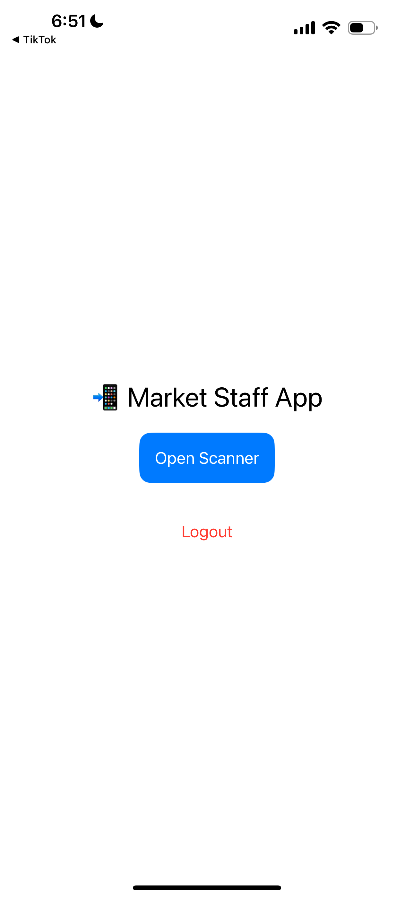
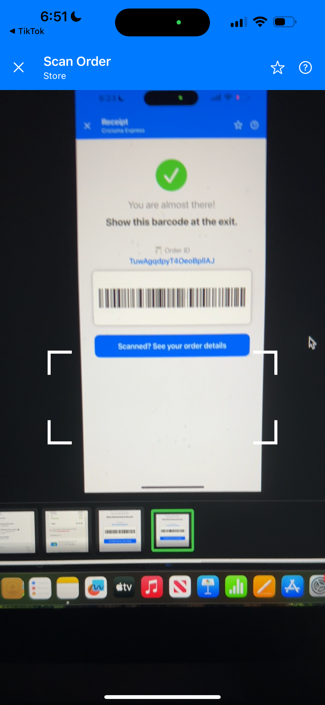
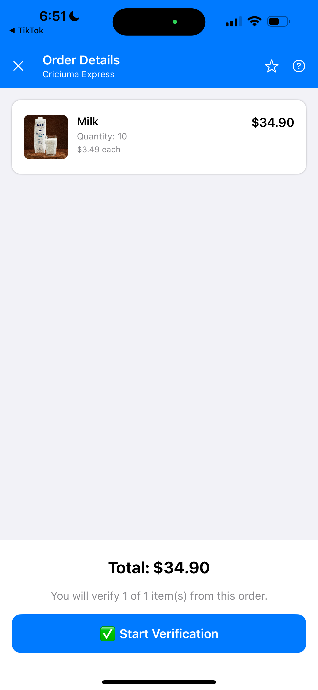
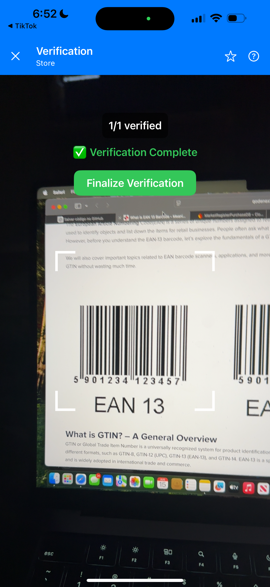
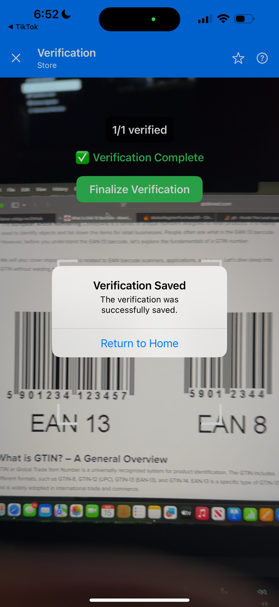

# 🏪 MarketStaffApp

**MarketStaffApp** is the staff-side companion application for supermarkets.  
It is part of the **MarketRegisterPurchase ecosystem**, designed to support the in-store verification process after a customer completes a self-checkout purchase.

Employees can scan the order receipt barcode, review the purchased items, and verify selected products to confirm the order’s accuracy.

---

## 📸 Screenshots

<p float="left">
  
  
  
</p>

<p float="left">
  
  
</p>

---

## ✨ Features
- 🔍 **Order Scanning** — Staff scans a customer’s order barcode  
- 📋 **Order Review** — Displays purchased items from Firestore  
- ✅ **Verification Flow** — Randomly selects products for validation  
- 📊 **Result Logging** — Records verification results in Firestore  
- 🔒 **Authentication** — Secure staff login using Firebase  

---

## 🛠 Tech Stack
- **Language**: Swift, SwiftUI  
- **Backend**: Firebase (Auth, Firestore)  
- **Camera**: AVFoundation (custom scanning box)  

---

## 🚀 Getting Started

1. Clone this repository:
   ```bash
   git clone https://github.com/yourusername/MarketStaffApp.git
